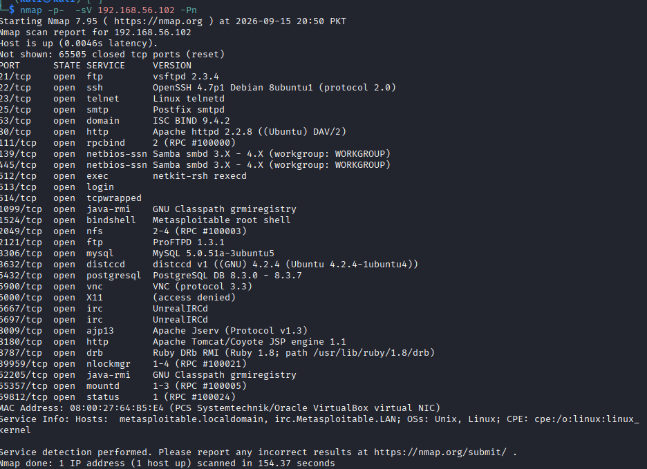
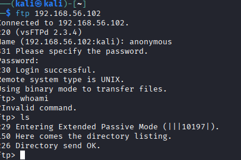
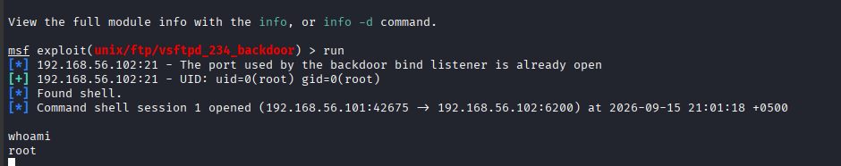

# FTP — File Transfer Protocol

## What is FTP?

FTP (File Transfer Protocol) is a network protocol used to transfer files between a client and a server.

During penetration testing, an FTP service can be interesting to investigate because misconfigured servers may expose files or allow unauthorized access.

## Default Port

* TCP 21

## FTP Enumeration

I used Nmap to identify the FTP service and determine its version:

```bash
nmap -sV -p 21 <TARGET_IP>
```

### What the command does

* `-p 21` → scans port 21
* `-sV` → attempts to identify the service and version

## Connecting to FTP

I can connect to an FTP server using:

```bash
ftp <TARGET_IP>
```

## Useful FTP Commands

| Command | Purpose                    |
| ------- | -------------------------- |
| `ls`    | List files and directories |
| `pwd`   | Show the current directory |
| `cd`    | Change directory           |
| `get`   | Download a file            |
| `put`   | Upload a file              |
| `bye`   | Exit FTP                   |

## Anonymous Access

Some FTP servers may allow anonymous login.

Anonymous access is important during enumeration because it may allow access to files without providing normal user credentials.

## Security Considerations

* FTP does not provide encryption by default.
* Anonymous access can expose files if incorrectly configured.
* Weak credentials can create security risks.
* Sensitive files should not be unnecessarily exposed through an FTP service.

## What I Learned

* How to identify an FTP service using Nmap.
* How to connect to an FTP server.
* How to navigate an FTP server.
* How to download files using `get`.
* Why anonymous FTP access should be checked during enumeration.
* Why unencrypted FTP is considered insecure.

## Practice

## Practice

I practiced these FTP concepts in an authorized TryHackMe training environment as part of the **Network Services** room. I also practiced FTP enumeration and exploitation on an intentionally vulnerable **Metasploitable 2** machine in my local virtual lab.
## Practical Lab — Metasploitable 2

I practiced FTP enumeration and exploitation on an intentionally vulnerable **Metasploitable 2** machine in my local virtual lab.

### Lab Objective

The objective of this lab was to:

* Identify the FTP service and its version.
* Test whether anonymous FTP access was enabled.
* Investigate the identified FTP service for known vulnerabilities.
* Use Metasploit to validate the vulnerability in the authorized lab environment.
* Understand the impact of a vulnerable FTP service.

### 1. Nmap Enumeration

I started by scanning the target with Nmap to identify the FTP service and determine its version.

```bash
nmap -sV -p 21 <TARGET_IP>
```

The scan identified FTP running on:

```text
21/tcp
```

Nmap also identified the FTP software and version running on the target.



### 2. Testing Anonymous Login

After identifying the FTP service, I tested whether anonymous authentication was allowed.

```bash
ftp <TARGET_IP>
```

I used:

```text
Username: anonymous
```

The server accepted the login, confirming that anonymous FTP access was enabled.



### 3. Anonymous Access Finding

The successful anonymous login showed that authentication was not required for access to the FTP service.

Anonymous access can be legitimate in some environments, but it can become a security issue if sensitive files are exposed or users are given unnecessary permissions.

### 4. Exploitation with Metasploit

After identifying the FTP software version, I investigated the service using the Metasploit Framework.

I used the relevant Metasploit module against the intentionally vulnerable Metasploitable 2 system.

```text
Module:
exploit/unix/ftp/vsftpd_234_backdoor
```

The exploitation was successful in the authorized lab environment.



### 5. Root Access Verification

After successful exploitation, I verified the privileges obtained on the target:

```bash
whoami
```

The result showed:

```text
root
```

This demonstrated the potential impact of an exploitable FTP service on a deliberately vulnerable system.

### Attack Chain

```text
Nmap
  ↓
Identify FTP
  ↓
Port 21 / Version Detection
  ↓
Test Anonymous Login
  ↓
Anonymous Access Successful
  ↓
Investigate FTP Vulnerability
  ↓
Metasploit
  ↓
Successful Exploitation
  ↓
Root Access
```

### Key Findings

| Stage             | Finding                                 | Impact                              |
| ----------------- | --------------------------------------- | ----------------------------------- |
| Nmap              | FTP running on TCP 21                   | FTP service exposed                 |
| Version detection | FTP software/version identified         | Allowed vulnerability research      |
| Authentication    | Anonymous login enabled                 | Unauthenticated FTP access          |
| Exploitation      | Vulnerable FTP service exploited in lab | System compromise                   |
| Final result      | Root privileges obtained                | Complete control of the lab machine |

### Security Recommendations

In a real environment:

* Disable anonymous FTP access when it is not required.
* Keep FTP software patched and updated.
* Restrict FTP access to trusted networks.
* Apply least-privilege permissions.
* Avoid exposing sensitive files through FTP.
* Consider secure alternatives such as SFTP where appropriate.
* Monitor FTP authentication and file-access activity.

### Lessons Learned

Through this lab, I learned that:

* Nmap can identify FTP services and their versions.
* Service-version detection is useful when investigating potential vulnerabilities.
* Anonymous login should be checked during FTP enumeration.
* FTP configuration and permissions can affect the security impact of anonymous access.
* Outdated vulnerable services can provide an attack path to system compromise.
* Enumeration should be performed before attempting exploitation.

> **Lab Disclaimer:** This exercise was performed against an intentionally vulnerable Metasploitable 2 machine in an authorized local lab environment. The techniques documented here should only be used on systems for which you have permission to test.


